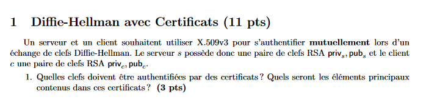

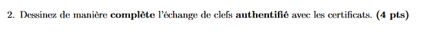

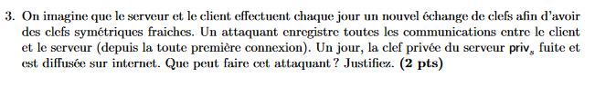

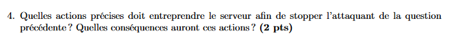

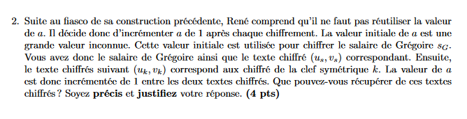

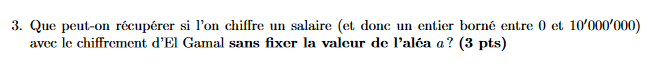

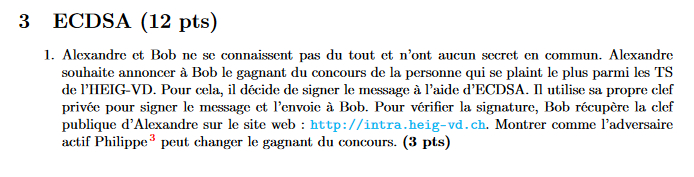

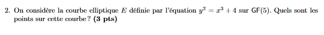

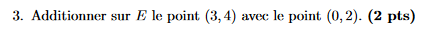

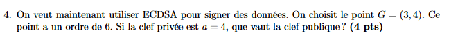

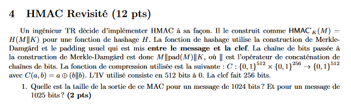

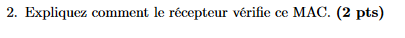

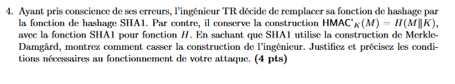

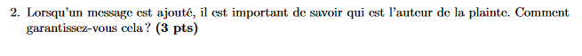

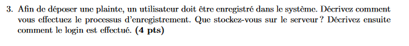

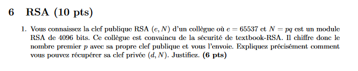

Il chiffre p donc c = p^clef privée, donc gcd(c,N) = p . 

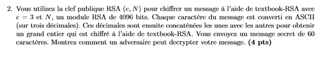

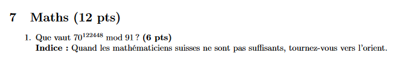

$91 = 7 * 13$ donc on utilise les restes chinois.  $ 70^{122448} \pmod 7 = 0 \pmod 7 $ et $70^{122448} \pmod {13} = 5 ^{122448} $  Comme mod premier avec exposant on peut travailler mod phi(7) et phi(13) dans l’exposant.  $122448 \pmod 6 = 0$ et $122448 \pmod 12 =  0 $ car sommes des chiffre divisible par 3 et il est pair.  Donc $  x \equiv 0 \pmod 7 $ et $ x \equiv 1 \pmod {13} $ donc le résultat vaut 14. 

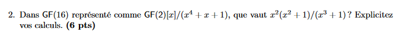

On fait d’abord  $ (x^4 + x^2 ) \pmod {x^4 + x + 1 } = x^2 + x + 1$  puis on multiplie par l’inverse de $x^3 + 1 $  qui vaut $x$  ( évident) donc on obtient $(x^4 + x^2)x = x^5 + x^3 = x^3 + x^2 + x $  
