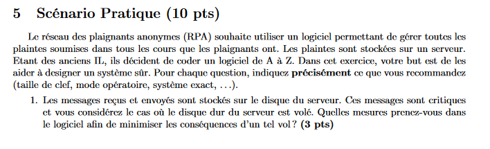

Ce sont les clés publiques qui doivent être authentifiées. Les éléments principaux sont la date de validé, un sujet correct ainsi qu'une signature valide (et la chaîne de signature).

// un dessin

L'attaquant peut se faire passer pour s auprès de c, et signer une nouvelle clé symétrique. Cela n'implique cependant rien pour les échanges précédents s'ils ont été enregistrés.

Il doit faire révoquer le précédent certificat (au plus vite) puis ré-établir un canal asymétrique garantissant l'authenticité.

On sait que `vk / vs = format(mk) / format(sg)` et on connaît la fonction format ainsi que *sg* donc on peut simplement déduire `mk = vk / (format(sg) * vs)` et on a récupéré la clé.

On a simplement incrémenté *a* donc on peut faire `mk = vk / (vs * format(sg) * Yg)`

Le chiffrement d'El Gamal est **non déterministe** donc on ne peut absolument rien en dire (chouette !)

Ici la connexion est en HTTP donc il n'y a pas de sécurité, le site peut très bien avoir été modifié. Ici il faudrait une connexion HTTPs qui permettrait d'établir de la sécurité basée sur un tier de confiance.

Les points sont O, (0;2), (0;3), (1;0), (3;1) et (3;4)

On calcule les coordonnées via la formule, on trouve le point (3; 1)

Dès qu'on trouve X = 3, on peut en déduire Y = 1 car on part déjà du point (3;4).

Si la clé privée vaut 4 alors la clé publique vaut 4 * G, puisque G à un ordre de 6 alors on sait que 6 * G = G et que 5 * G = O

On peut donc trouver la clé publique en faisant O - G, soit -G, soit (3;1) 

Le plus simple me semble de chiffrer le disque dur du serveur.

On implémente un système de signatures, par exemple on pourrait stoquer un MAC qui serait un hash du nom d'utilisateur ou quelque chose du genre pour pas être trop lourd.

On fait simplement un formulaire d'enregistrement web (bien sûr implémentant HTTPS pour que la connexion soit chiffrée) et on stoque le hash du mot de passse utilisateur dans la base de données avec le username de ce dernier. Pour la connexion, on hash le mot de passe qu'il envoie et on compare avec la valeur dans la base de données.

Je pense que SHA256 ça suffit pour le hash et on utilise X.509 pour le certificat.

